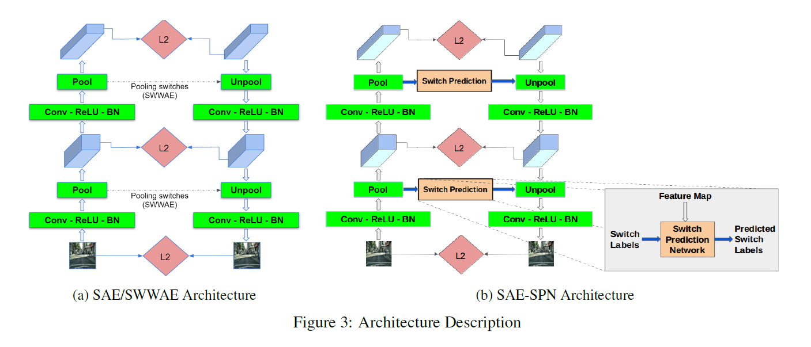
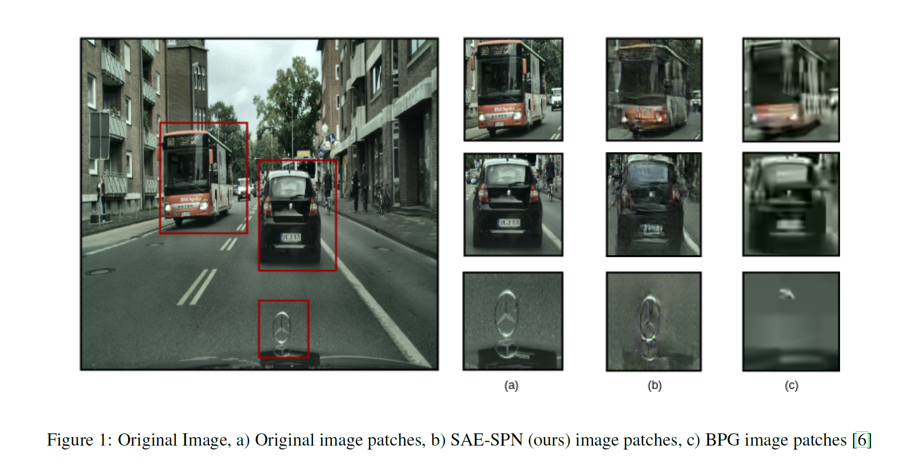
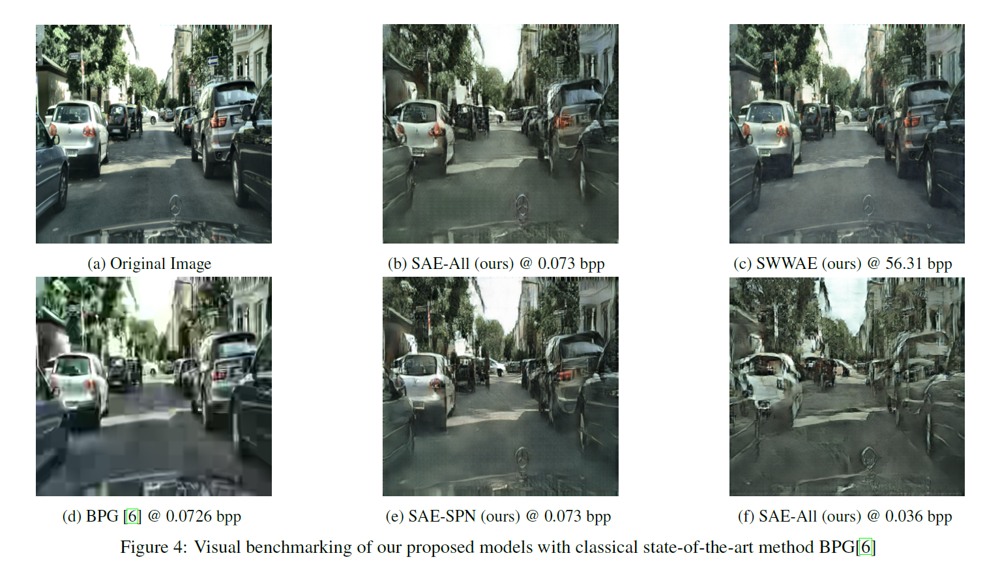

# CompressNet

This is the official repository for CompressNet: Generative Compression at Extremely low bitrates published in IEEE WACV 2020. [Paper link](http://openaccess.thecvf.com/content_WACV_2020/papers/Raman_CompressNet_Generative_Compression_at_Extremely_Low_Bitrates_WACV_2020_paper.pdf)

We propose novel deep learning based approach **SAE-SPN** (Stacked Autoencoders with Switch Prediction Network) and we compare it with SAE and SWWAE (Stacked What Where Autoencoder) to measure its efficiency in comparing images at extremely low bitrates and maintaining perceptual quality at the same time.

The architecture is based on adversarial autoencoders. This is to ensure that the reconstruction is significatly sharper when compared to more fuzzy vanilla autoencoder reconstructions. A better representation is as follows



On benchmarking the performance with other State-Of-The-Art deep learning approaches and traditional compression methods like JPEG and BPG we see that our proposed method performs better when it comes to compressing images to extremely low bitrates(compared to Deep Learning SOTA methods) while maintaining an impressive perceptual quality (compared to JPEG, BPG). 





## Dependencies

- Python >= 3.6
- Pytorch >= 1.0
- matplotlib >= 3.0
- torchvision >= 0.2
       

## Data / Setup                 
        ├── professional_train
            ├── train
        ├── professional_valid
            ├── valid
        ├── train               # Mobile
        ├── valid               # Mobile
Training was done using the Cityscapes dataset and the CLIC Dataset. Given the data folder, the data is preprocessed and the dataloader is created for training.
Copy the 4 zip files onto this folder and extract. By default, you will get the following file structure. This is used in the DataLoader (refer to main.py))

## How to run

### Training
To run the training loop for the entire pipeline, run on command line/terminal

```
python3 run.py 
```

### Testing
To run the inference loop for the entire pipeline
Download the trained checkpoint from the [drive link](https://drive.google.com/open?id=1tu4REEriS4vkWcrqSxcGvjb9P0-Cl8n6)
Add it to the SAE_SPN/Checkpoints/ folder. This code evaluates the SAE-spn algorithm for all images in the SAE_SPN/Dataset/test/ folder.


```
cd SAE_SPN/
python3 inference.py
```

## Additional Notes

### Contact

For any queries contact the authors [Suraj Kiran Raman](surajkra@umich.edu), [Aditya Ramesh](raaditya@umich.edu), [Vijayakrishna Naganoor](vijaykn@umich.edu), [Shubham Dash](shubhamd@umich.edu), [Giridharan Kumaravelu](girikum@umich.edu)

### Citation

```
@InProceedings{Raman_2020_WACV,
author = {Raman, Suraj Kiran and Ramesh, Aditya and Naganoor, Vijayakrishna and Dash, Shubham and Kumaravelu, Giridharan and Lee, Honglak},
title = {CompressNet: Generative Compression at Extremely Low Bitrates},
booktitle = {The IEEE Winter Conference on Applications of Computer Vision (WACV)},
month = {March},
year = {2020}
}
```
